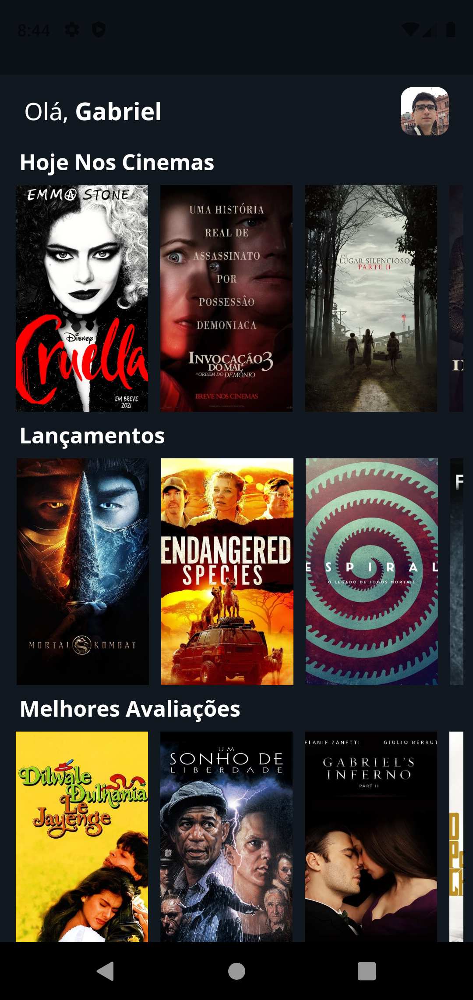

# Movies App

Desafio Final do curso de Desenvolvimento Mobile com Flutter da Cubos Academy. Foi proposto a criação de um aplicativo na arquitetura MVVM com infinite scroll que pegasse os dados de uma API pública de filmes e exibisse ao usuário informações como título do filme, data de estreia, poster e também possibilitasse salvar os filmes nos favoritos.

## Screenshots

 