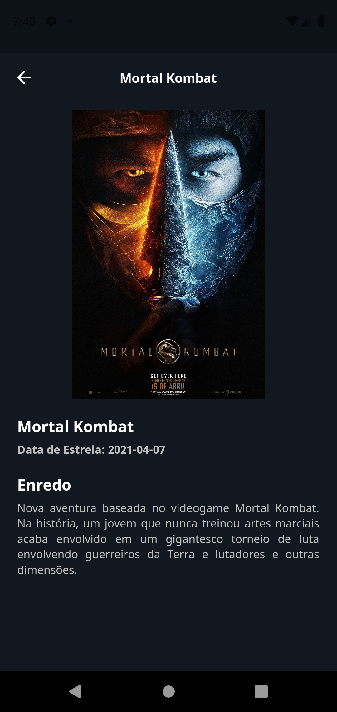
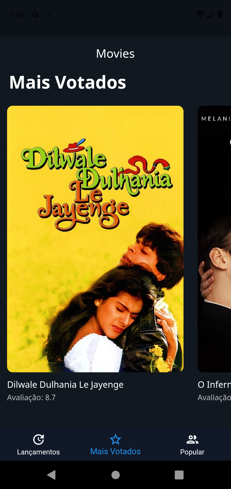

# Movies App

Desafio do Módulo 1 da Cubos Academy. Foi proposto a criação de um aplicativo que pegasse os dados de uma API pública de filmes e exibisse ao usuário informações como título do filme, data de estreia, poster, etc.

## Screenshots

  